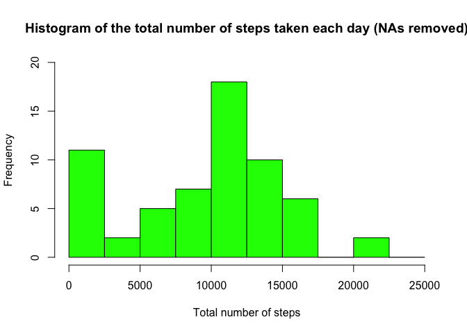
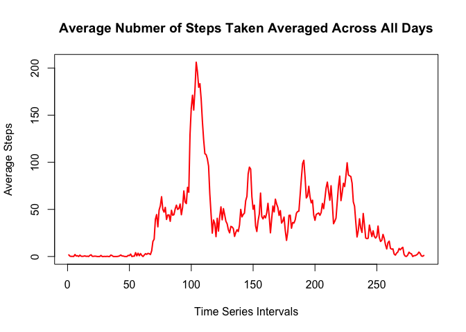
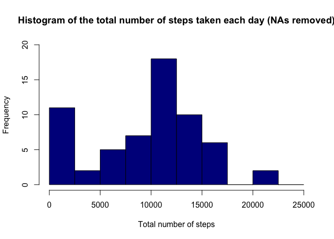
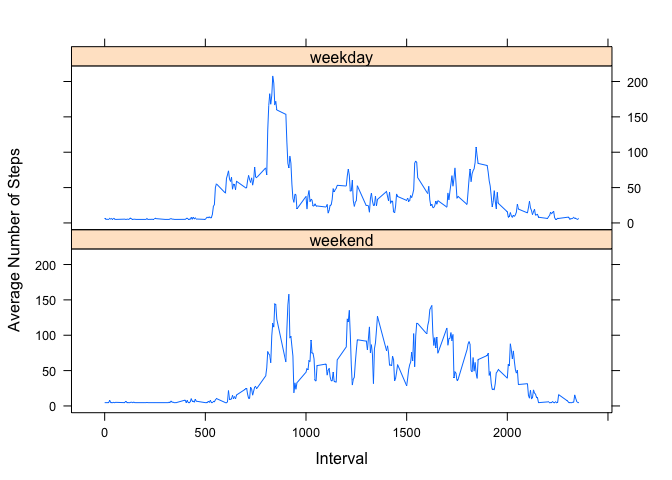

# Reproducible Research Peer Assignment 1
Archer Lebron  
October 11, 2016  
 
This is the first assignment for the Coursera Reproducible Research.  This assignment
consists of the analysis of personal moving activity data that has been collected using monitoring 
devices such as Fitbit, Nike Fuelband, and/or Jawbone Up.


**Loading and preprocessing the data**

1. Load the data
2. Process/transform the data (if necessary) into a format suitable for your analysis

```r
getwd()
```

```
## [1] "/Users/ArcherJime/Downloads/Archer Folder/Coursera_ReproducibleResearch"
```

```r
setwd("/Users/ArcherJime/Downloads/Archer Folder/Coursera_ReproducibleResearch")
activity <- read.csv("activity.csv", header = TRUE)
head(activity)
```

```
##   steps       date interval
## 1    NA 2012-10-01        0
## 2    NA 2012-10-01        5
## 3    NA 2012-10-01       10
## 4    NA 2012-10-01       15
## 5    NA 2012-10-01       20
## 6    NA 2012-10-01       25
```

```r
class(activity$date)
```

```
## [1] "factor"
```


**What is mean total number of steps taken per day?**

1. Calculate the total number of steps taken per day

```r
# Calculate the total number of steps taken per day
daysteps <- tapply(activity$steps, activity$date, sum, na.rm=TRUE)
daysteps
```

```
## 2012-10-01 2012-10-02 2012-10-03 2012-10-04 2012-10-05 2012-10-06 
##          0        126      11352      12116      13294      15420 
## 2012-10-07 2012-10-08 2012-10-09 2012-10-10 2012-10-11 2012-10-12 
##      11015          0      12811       9900      10304      17382 
## 2012-10-13 2012-10-14 2012-10-15 2012-10-16 2012-10-17 2012-10-18 
##      12426      15098      10139      15084      13452      10056 
## 2012-10-19 2012-10-20 2012-10-21 2012-10-22 2012-10-23 2012-10-24 
##      11829      10395       8821      13460       8918       8355 
## 2012-10-25 2012-10-26 2012-10-27 2012-10-28 2012-10-29 2012-10-30 
##       2492       6778      10119      11458       5018       9819 
## 2012-10-31 2012-11-01 2012-11-02 2012-11-03 2012-11-04 2012-11-05 
##      15414          0      10600      10571          0      10439 
## 2012-11-06 2012-11-07 2012-11-08 2012-11-09 2012-11-10 2012-11-11 
##       8334      12883       3219          0          0      12608 
## 2012-11-12 2012-11-13 2012-11-14 2012-11-15 2012-11-16 2012-11-17 
##      10765       7336          0         41       5441      14339 
## 2012-11-18 2012-11-19 2012-11-20 2012-11-21 2012-11-22 2012-11-23 
##      15110       8841       4472      12787      20427      21194 
## 2012-11-24 2012-11-25 2012-11-26 2012-11-27 2012-11-28 2012-11-29 
##      14478      11834      11162      13646      10183       7047 
## 2012-11-30 
##          0
```

2. If you do not understand the difference between a histogram and a barplot, research the difference between them. Make a histogram of the total number of steps taken each day

```r
# Histogram of the total number of steps taken each day
hist(daysteps, breaks=seq(from=0, to=25000, by=2500), col = "green", xlab="Total number of steps", ylim=c(0,20), main="Histogram of the total number of steps taken each day (NAs removed)")
```

\

3. Calculate and report the mean and median of the total number of steps per day

```r
# Mean of the total number of steps per day
mean(daysteps, na.rm = TRUE)
```

```
## [1] 9354.23
```

```r
# Median of the total number of steps per day
median(daysteps, na.rm = TRUE)
```

```
## [1] 10395
```


**What is the average daily activity pattern?**

1. Make a time series plot (i.e. type ="1") of the 5-minute interval (x-axis) and the average number of steps taken, averaged across all days (y-axis)

```r
# Calculate the average number of steps taken by each interval across all days
avgsteps <- tapply(activity$steps, activity$interval, mean, na.rm=TRUE)
# Plot a time series for the average number of steps taken, averaged across all days
plot(avgsteps, type = "l", col = "red", lwd = 2,xlab="Time Series Intervals", ylab = "Average Steps", main = "Average Nubmer of Steps Taken Averaged Across All Days")
```

\

2. Which 5-minute interval, on average across all the days in the dataset, contains the maximum number of steps?

```r
# Identify the interval with the maximum number of steps (sort in decreasing order)
sort(avgsteps, decreasing = TRUE)
```

```
##         835         840         850         845         830         820 
## 206.1698113 195.9245283 183.3962264 179.5660377 177.3018868 171.1509434 
##         855         815         825         900         810         905 
## 167.0188679 157.5283019 155.3962264 143.4528302 129.4339623 124.0377358 
##         910         915         920        1550        1845        1545 
## 109.1132075 108.1132075 103.7169811 102.1132075  99.4528302  98.6603774 
##         925        1210        1215        1205        1850        1855 
##  95.9622642  94.8490566  92.7735849  87.6981132  86.5849057  85.6037736 
##        1840        1815        1900        1555        1540        1725 
##  85.3396226  85.3207547  84.8679245  83.9622642  82.9056604  78.9433962 
##        1905        1830        1740        1810        1610        1835 
##  77.8301887  77.6981132  75.0943396  74.6981132  74.5471698  74.2452830 
##         800        1720         745        1730         805        1825 
##  73.3773585  72.7169811  69.5471698  68.9433962  68.2075472  67.7735849 
##        1255         930        1535        1605        1200         615 
##  67.2830189  66.2075472  65.3207547  64.1320755  63.8679245  63.4528302 
##        1220        1615        1600        1715        1355        1625 
##  63.3962264  63.1698113  62.1320755  61.2264151  60.8113208  59.7735849 
##        1735        1820        1155        1910        1805         750 
##  59.6603774  59.2641509  59.1886792  58.0377358  58.0188679  57.8490566 
##        1620        1745        1325        1705         755        1400 
##  56.9056604  56.5094340  56.4339623  56.3018868  56.1509434  55.7547170 
##         730         715        1230         610        1345        1915 
##  55.6792453  54.5094340  54.4716981  53.7735849  53.5471698  53.3584906 
##        1015         740         630        1405         725        1025 
##  52.6603774  52.2641509  52.1509434  51.9622642  50.9811321  50.7924528 
##        1710         710        1225        1135         620         720 
##  50.7169811  50.5094340  50.1698113  49.9811321  49.9622642  49.9245283 
##         605         655        1415        1530        1525        1350 
##  49.2641509  49.0377358  48.6981132  48.1320755  47.7547170  47.3207547 
##         625        1700        1320        1650        1150        1520 
##  47.0754717  46.6226415  46.2452830  46.2075472  46.0377358  45.9622642 
##        1950        1645         935        1250        1640        1145 
##  45.6603774  45.4528302  45.2264151  45.0566038  44.6603774  44.6037736 
##         555         705         735        1030         645         640 
##  44.4905660  44.3773585  44.3207547  44.2830189  44.1698113  44.0188679 
##        1630         700        1455        1655        1450        1410 
##  43.8679245  43.8113208  43.7735849  43.6792453  43.6226415  43.5849057 
##        1310        1330        1010        1300        1140        1430 
##  43.2641509  42.7547170  42.4150943  42.3396226  42.0377358  41.8490566 
##        1315        1800        1000        1935        1340        1305 
##  40.9811321  40.6792453  40.5660377  40.0188679  39.9622642  39.8867925 
##         550         635        1020        1515         945        1635 
##  39.4528302  39.3396226  38.9245283  38.8490566  38.7547170  38.5660377 
##        1245        1425        1755        1035         650        1920 
##  37.7358491  37.5471698  37.4528302  37.4150943  37.3584906  36.3207547 
##        1505        1510        1420         950        1750        1040 
##  36.0754717  35.4905660  35.4716981  34.9811321  34.7735849  34.6981132 
##        1955        1130        2015        1235        2050        1055 
##  33.5283019  33.4339623  33.3396226  32.4150943  32.3018868  31.9433962 
##         600        1100        1940        1500        1105        1120 
##  31.4905660  31.3584906  30.2075472  30.0188679  29.6792453  28.3773585 
##        1045        1435        1930        2030        1005        2020 
##  28.3396226  27.5094340  27.3962264  27.3018868  26.9811321  26.8113208 
##        1240        1125        1445        1115        1945        1335 
##  26.5283019  26.4716981  26.0754717  25.5471698  25.5471698  25.1320755 
##        1050         940        2110        2035        1110        2045 
##  25.0943396  24.7924528  23.4528302  21.3396226  21.3207547  21.3207547 
##        2025         955        1925        2055        2000        2040 
##  21.1698113  21.0566038  20.7169811  20.1509434  19.6226415  19.5471698 
##        2010        2115        2005         545        2105        1440 
##  19.3396226  19.2452830  19.0188679  18.3396226  17.2264151  17.1132075 
##        2135         540        2100        2130        2120        2230 
##  16.3018868  16.0188679  15.9433962  14.6603774  12.4528302   9.7547170 
##        2225        2140        2215        2150        2125        2145 
##   8.6981132   8.6792453   8.5094340   8.1320755   8.0188679   7.7924528 
##        2220         535        2210        2335        2255         430 
##   7.0754717   6.0566038   4.8113208   4.6981132   4.6037736   4.1132075 
##        2205         440         520        2300        2340         450 
##   3.6792453   3.4905660   3.3207547   3.3018868   3.3018868   3.1132075 
##         510         525        2305        2155        2330         410 
##   3.0000000   2.9622642   2.8490566   2.6226415   2.6037736   2.5660377 
##         515        2235          25         530         130           0 
##   2.2452830   2.2075472   2.0943396   2.0943396   1.8301887   1.7169811 
##         330        2250        2325         505         250          45 
##   1.6226415   1.6037736   1.5849057   1.5660377   1.5471698   1.4716981 
##        2200         400         210         125         455        2355 
##   1.4528302   1.1886792   1.1320755   1.1132075   1.1132075   1.0754717 
##        2320         255         405          35         445        2315 
##   0.9622642   0.9433962   0.9433962   0.8679245   0.8301887   0.8301887 
##         105         435        2345         325         335          30 
##   0.6792453   0.6603774   0.6415094   0.6226415   0.5849057   0.5283019 
##         340         145         425           5         115         420 
##   0.4905660   0.3773585   0.3584906   0.3396226   0.3396226   0.3396226 
##         100        2240          50         150         235        2350 
##   0.3207547   0.3207547   0.3018868   0.2641509   0.2264151   0.2264151 
##         320         135         140          15         110          10 
##   0.2075472   0.1698113   0.1698113   0.1509434   0.1509434   0.1320755 
##          55         225        2245          20         345          40 
##   0.1320755   0.1320755   0.1132075   0.0754717   0.0754717   0.0000000 
##         120         155         200         205         215         220 
##   0.0000000   0.0000000   0.0000000   0.0000000   0.0000000   0.0000000 
##         230         240         245         300         305         310 
##   0.0000000   0.0000000   0.0000000   0.0000000   0.0000000   0.0000000 
##         315         350         355         415         500        2310 
##   0.0000000   0.0000000   0.0000000   0.0000000   0.0000000   0.0000000
```


**Imputing missing values**

1. Calculate and report the total number of missing values in the dataset (i.e. the total number of rows with 𝙽𝙰s)

```r
# Calculate the total number of NAs
Total_NA <- sum(is.na(activity))
Total_NA
```

```
## [1] 2304
```

2. Devise a strategy for filling in all of the missing values in the dataset. The strategy does not need to be sophisticated. For example, you could use the mean/median for that day, or the mean for that 5-minute interval, etc.

```r
# Identify the index positions of the NAs
na_ind <- which(is.na(activity$steps))
# Create a vector the length of total NAs with the average of steps throughout all the days
meanvec <- rep(mean(activity$steps, na.rm=TRUE), times = length(na_ind))
```

3. Create a new dataset that is equal to the original dataset but with the missing data filled in.

```r
# Replace missing values (NAs) with the average value of steps 
activity[is.na(activity)] <- meanvec
```

4. Make a histogram of the total number of steps taken each day and Calculate and report the mean and median total number of steps taken per day. Do these values differ from the estimates from the first part of the assignment? What is the impact of imputing missing data on the estimates of the total daily number of steps?


```r
# Histogram of the total number of steps taken each day
hist(daysteps, breaks=seq(from=0, to=25000, by=2500), col = "dark blue", xlab="Total number of steps", ylim=c(0,20), main="Histogram of the total number of steps taken each day (NAs removed)")
```

\

```r
# Calculate the mean total number of steps taken per day
mean(daysteps)
```

```
## [1] 9354.23
```

```r
# Calculate the median total number of steps take per day
median(daysteps)
```

```
## [1] 10395
```


**Are there differences in activity patterns between weekdays and weekends?**

1. Create a new factor variable in the dataset with two levels – “weekday” and “weekend” indicating whether a given date is a weekday or weekend day.

```r
# Convert dates factor variable to Date 
activity$date <- as.Date(activity$date)
class(activity$date)
```

```
## [1] "Date"
```

```r
# Create a vector of weekdays
weekdays0 <- c('Monday', 'Tuesday', 'Wednesday', 'Thursday', 'Friday')
# Use '%in%' and 'weekdays' to create a logical vector
activity$Daytype <- factor((weekdays(activity$date) %in% weekdays0), levels=c(FALSE,TRUE), labels=c('weekend', 'weekday'))
head(activity)
```

```
##     steps       date interval Daytype
## 1 37.3826 2012-10-01        0 weekday
## 2 37.3826 2012-10-01        5 weekday
## 3 37.3826 2012-10-01       10 weekday
## 4 37.3826 2012-10-01       15 weekday
## 5 37.3826 2012-10-01       20 weekday
## 6 37.3826 2012-10-01       25 weekday
```

2. Make a panel plot containing a time series plot (i.e. 𝚝𝚢𝚙𝚎 = "𝚕") of the 5-minute interval (x-axis) and the average number of steps taken, averaged across all weekday days or weekend days (y-axis). See the README file in the GitHub repository to see an example of what this plot should look like using simulated data.


```r
# Load the lattice graphical library
library(lattice)

# Compute the average number of steps taken, averaged across all daytype variable
days_mean <- aggregate(activity$steps, by=list(activity$Daytype, activity$interval),mean)

# Rename the attributes
names(days_mean) <- c("daytype", "interval", "mean")
head(days_mean)
```

```
##   daytype interval     mean
## 1 weekend        0 4.672825
## 2 weekday        0 7.006569
## 3 weekend        5 4.672825
## 4 weekday        5 5.384347
## 5 weekend       10 4.672825
## 6 weekday       10 5.139902
```

```r
# Compute the time series plot
xyplot(mean ~ interval | daytype, days_mean, type="l", lwd=1, xlab="Interval", ylab="Average Number of Steps", layout=c(1,2))
```

\


